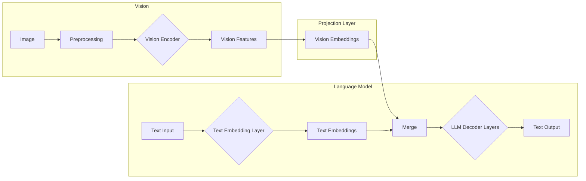
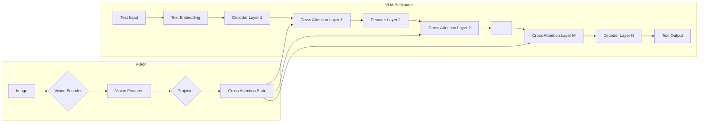
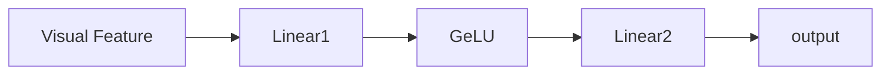
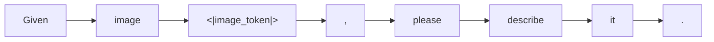
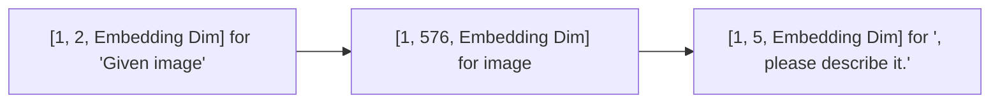

# Hitchhiker's Guide to Vision Language Models

Author: Webster Bei Yijie

## What Are Vision Language Models
Nowadays there are Large Language Models that can take in multiple different modalities (images, videos, audio, text) and even output in multiple different modalities. In this article though, I will loosely define Vision Language Models to be a subclass of Large Language Models that is at least able to take in both images and texts as input, and generate text responses.

## Why Are Vision Language Models Useful
Vision Language Models (VLMs) are useful because they provide a unified way to handle many different computer vision tasks. Traditionally, computer vision tasks like image classification, object detection, and image captioning each required their own specialized models and training approaches. For example, you would need one model for classifying images into categories, another model for detecting objects and their locations, and yet another model for generating text descriptions of images.

VLMs change this by being able to handle all these tasks through natural language interaction. The same VLM can classify images by answering questions about the image content, detect objects by describing what it sees and where, and generate captions by being asked to describe the image. This unified approach makes VLMs very versatile - they can adapt to new vision tasks without needing to be specifically trained for each one.

Additionally, because VLMs understand both images and language, they can perform more complex reasoning tasks that combine both modalities, like answering detailed questions about images or comparing multiple images. This makes them particularly useful for real-world applications where flexibility and natural interaction are important.

## Architectures of Vision Language Models
Although there are lots of VLMs out there, most VLMs share a very similar fundamental architecture that was first introduced in the LLaVA model (correct me if I'm wrong about LLaVA being the first). The architecture looks like this:



Notably:
- Vision Encoder: A neural network that turns an image into dense feature representations
    - Some common choices are CLIP, SigLIP
- Projection Layer: A projection layer that transforms dense features from the vision encoder so that:
    - It will have similar semantic meaning as text embeddings
    - It will have the same embedding dimension as text embeddings
    - A very common choice is `Linear(GeLU(Linear(x)))`
- Text Embedding Layer + LLM Decoder Layers: Make up your regular LLM
- Merge: A process which merges vision embeddings and text embeddings
    - Could be as simple as concatenation
    - More commonly, vision embeddings are inserted into text embeddings at some locations in the sequence dimension

So in general, you have a vision encoder and projector combination that transforms your image into some `[Batch Size, Num Vision Tokens, Embedding Dim]` shaped thingy, which gets concatenated somehow with the `[Batch Size, Num Text Tokens, Embedding Dim]` text token embed right before the first decoder layer, and then the combined embed gets fed into the subsequent language model decoder layers. 

Both the vision encoder and the language model backbone are typically already pretrained to start with.

Among the more widely adopted VLMs, LLaMA Vision is the odd one out. The architecture of LLaMA Vision model looks like this instead:

Note that the above diagram is for illustration purposes. The interleaving and arrangment of the cross attention layers and regular decoder layers are different in the actual models. 

So LLaMA Vision similarly encodes images into some feature representation, but uses cross attention layers to inject the vision features into the language model. LLaMA Vision models are also built on top of the language only models. The cross attention layers are interleavingly inserted into the decoder layers of a pretrained LLaMA model. During VLM training, all the weights from the language model (text embedding layer, decoder layers and LM head) are frozen. This is to ensure that the LLaMA Vision model behaves exactly the same as the original LLM if the input contains no image at all.

## The Variants
Since many new models more or less follow the LLaVA kind of overall architecture, I will introduce them as variants. There are typically several components that you can tweak/swap: image preprocessing, vision encoder, projection layer and merge. You can essentially mix and match to get your own VLM variant (with some training of course).

For simplicity, I will mostly explain assuming that the VLM only takes in a single image. Extension to multiple images is typically very straightforward.

### Image Preprocessing
Image preprocessing is the step that takes in an image and outputs a tensor (or numpy array, which then gets converted to tensor) that can be consumed by the vision encoder. Since most vision encoders such as CLIP and SigLIP are only able to consume images of certain fixed size, the job of the image preprocessing step is to basically resize the images somehow. Using openai/clip-vit-large-patch14-336 as an example, this CLIP module can only take in images of size $336 \times 336$ and we would need to convert the input images into this specific size. The image processor of CLIP and SigLIP already performs resizing for you, so anything more advanced that you want to do will need to be done before the image preprocessors. In addition to the resizing, CLIP/SigLIP processors also does normalization/scaling for the pixel values.

**Option 1: Simple Resizing**  
As simple as it sounds, simply reshape the image into the desired $336 \times 336$ shape.

**Option 2: Pad and Resize**  
The aspect ratio of the content might be important, so *Option 1* may not be ideal. The alternative is to pad the image to make it square before resizing. This is the approach that the original llava LLaVA 1.0 takes. 

**Option 3: Improved Resolution with Scanning**  
Resizing all images to as small as $336 \times 336$ is not always a good idea since too much detail will be lost during downsampling. To reconcile between the fixed small size that vision encoders can take in and the need for details in high resolution images, a technique sometimes referred to as *scanning* is applied. A large image is resized and padded to some multiples of $336$ for both width and height based on the aspect ratio, and then chunked into tiles of size $336 \times 336$. For example, an image of size $1024 \times 1024$ might get downsized to $672 \times 672$ and chunked into 4 $336 \times 336$ pieces. Each of these tiles then gets processed by the vision encoder separately, allowing the model to capture both the overall composition and fine details of the image. As reference, the code below copied from [LLaVA repository](https://github.com/haotian-liu/LLaVA) performs this resizing intelligently by balancing `effective resolution` and `wasted resolution` (how much padding was added):
```Python
def select_best_resolution(original_size, possible_resolutions):
    """
    Selects the best resolution from a list of possible resolutions based on the original size.

    Args:
        original_size (tuple): The original size of the image in the format (width, height).
        possible_resolutions (list): A list of possible resolutions in the format [(width1, height1), (width2, height2), ...].

    Returns:
        tuple: The best fit resolution in the format (width, height).
    """
    original_width, original_height = original_size
    best_fit = None
    max_effective_resolution = 0
    min_wasted_resolution = float('inf')

    for width, height in possible_resolutions:
        scale = min(width / original_width, height / original_height)
        downscaled_width, downscaled_height = int(original_width * scale), int(original_height * scale)
        effective_resolution = min(downscaled_width * downscaled_height, original_width * original_height)
        wasted_resolution = (width * height) - effective_resolution

        if effective_resolution > max_effective_resolution or (effective_resolution == max_effective_resolution and wasted_resolution < min_wasted_resolution):
            max_effective_resolution = effective_resolution
            min_wasted_resolution = wasted_resolution
            best_fit = (width, height)

    return best_fit
```
This `scanning` technique is used in many open source VLMs such as LLaVA 1.5, LLaVA Next, Phi 3 Vision model although the exact resizing logic may be different.

Notes on the the number of image tokens:
For LLaVA 1.0, the number of image tokens is 576 because this is how much vision tokens that the CLIP model outputs. For other models, typically the number of vision tokens increases with increasing resolution. It is understandable with the `scanning` technique. Phi 3 vision might be the odd one out because it resizes the images based on aspect ratio [code here](https://huggingface.co/microsoft/Phi-3-vision-128k-instruct/blob/c45209e90a4c4f7d16b2e9d48503c7f3e83623ed/image_processing_phi3_v.py#L67)

### Vision Encoder
Vision encoders transform a preprocessed image into vision features. There are many choices for the vision encoders. Typically you take some intermediate hidden state state from the vision encoder as the output feature representation.

**CLIP**  
used by LLaVA family of VLMs, Phi 3/3.5 Vision etc

**SigLIP**  
used by Idefics, PaliGemma etc

**InternViT**  
used by InternVL

**Others**  
The choice of vision encoder somewhat guides the way you do preprocessing. 
If you are not using CLIP or SigLIP, then you are not constrained by the fixed input resolution. In Qwen2 VL, a method called Naive Dynamic Resolution is introduced. Simply put, it converts your input image into a sequence of $28 \times 28$ patches, embed the patches, and then process the input sequence like a language model. Pixtral from Mistral AI does it similarly.


### Projection Layer
Projection layer maps vision encoder output to text embedding space in the LLM backbone. Mechanically, the vision encoder output has shape `[Batch Size, Number of Visual Tokens, Feature Dim]`, and `feature dim` is usually different from the embedding dim of the LLM backbone. To be able to merge the vision features into text embeddings via simple concatenation (which most LLaVA style VLMs adopt), you need to project `feature dim` to `embedding dim`. That can be done with one linear layer. Semantically, you also want to remap the visual feature into the text embedding space, so some non-linear transformation is needed. A very common choice that seem to work pretty well is surprisingly simple:

VLMs using this projection architecture includes: LLaVA Family, Qwen 2 VL, Qwen 2.5 VL, Phi 3 Vision etc

More complicated choices includes LLM style MLP (i.e gate up proj) combined with `perceiver` layers (similar to decoder layers) used in idefics2, and pixel shuffle combined with single linear projection in idefics3, and super simple single layer linear in PaliGemma.

### Merging
For LLaVA style VLMs, the merging of the vision features (vision embeddings) and text embeddings happen before the first LLM decoder layer. The vision embeddings are inserted into the text embeddings at certain locations in the sequence dimension. To explain how it works, let's start with a text query:


The text query would contain a special token `<|image_token|>` which gets tokenized into a special token `image_token_id`. Now assume that the supplied image gets projected into vision embeddings, and the shape is `[1, 576, Embedding Dim]`, and the text embeddings have shape `[1, 8, Embedding Dim]` where the embedding at index 2 is embedding of `image_token_id`. The merging basically replaces the single embedding for the `image_token_id` with the `[1, 576, Embedding Dim]` shaped vision embeddings.


So you end up with a merged embedding of shape `[1, 583, Embedding Dim]` into the decoder layers.

## Vision Language Model Training
VLMs are often times second class citizen in the sense that they are typically not trained from scratch. It is more common to pick a pretrained vision encoder and pretrained LLM, glue them together with some projector layer, some merging mechanism, and perform a (relatively) lightweight training/fine-tuning to get a working VLM.

VLMs typically go through two stages of training (or more for newer ones):
- Projector training for vision encoder and LLM alignment
- End to end training for instruction fine tuning

In the alignment stage, one typically uses simple image and text pairs as training data, and only the projector layer is trained (LLM and vision encoders are frozen). The purpose of this step is to train the projector for semantic alignment aforementioned. Some training data could be used includes LAION, CC3M, CC12M etc.

In the second stage, one typically uses instruction fine tuning dataset containing images mixed with regular instruction fine tuning dataset, and fine tune the VLM end to end. It is also typical that the vision encoder is frozen or both the projector and the vision encoder are frozen at this stage.

## The End
Now hope you have a better understanding of the Vision Language Model architectures and how they are trained. In terms of reasoning and overall quality, there is still a gap between SOTA language models and SOTA VLMs at least in the open source world. So VLMs do not appear as smart of SOTA LLMs. In terms of applications, chat with image input is also not as demanded as LLMs since most questions people have day to day can get away without vision. 

VLMs, however, are seeing a perhaps even greater potential in computer use. There has been numerous fine tuned VLMs for understanding your browser content. Given that HTML / webpage especially those with javascript and dynamically loaded content are so hard (and unnecessary) to parse, handling computer use via VLM seem to provide a good alternative.

General agents, just like autonomous driving, will need a brain (or multiple brains) behind the stages, namely perception, planning and control. VLM will be critical to solve the perception stage, and potentially part of the control stage (given that you might need a VLM to tell you how/where to take an action).

## References
- https://llava-vl.github.io/
- https://arxiv.org/abs/2409.12191
- https://arxiv.org/abs/2502.13923
- https://arxiv.org/abs/2404.14219
- https://github.com/huggingface/transformers
- https://ai.meta.com/blog/llama-3-2-connect-2024-vision-edge-mobile-devices/


